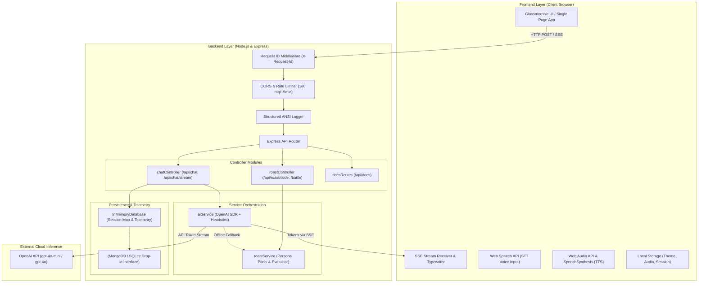
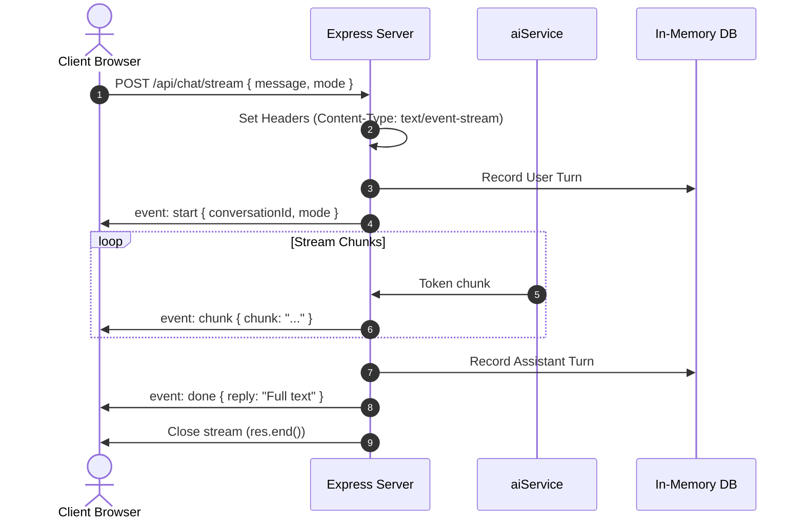

# System Architecture & Technical Specification

> **DA ROAST BOT v2.0**  
> *Final-Year B.Tech Computer Science & Engineering Architecture Document*

---

## 1. High-Level Architecture Overview

DA Roast Bot is constructed as a decoupled, asynchronous, full-stack conversational AI platform. It emphasizes fault-tolerant design, real-time token streaming, state persistence, and educational scaffolding wrapped in satirical college peer banter.



---

## 2. Request Lifecycle & Middleware Pipeline

Every HTTP request traverses a standardized pipeline:

1. **`requestIdMiddleware`**: Injects or derives an `X-Request-Id` UUID, making all log entries trace-correlated.
2. **`cors`**: Whitelists cross-origin headers, pre-flight caches, and exposes `X-Request-Id`.
3. **`express.json` / `express.urlencoded`**: Body parsing with a defensive 2MB ceiling.
4. **`httpLogger`**: High-resolution timer (`process.hrtime()`) logging timestamp, method, path, HTTP status, and duration in milliseconds.
5. **`express-rate-limit`**: Sliding-window IP rate limiter preventing resource starvation (180 req / 15 min).
6. **Controller Layer**: Input validation, sanitization, mode selection, and database write.
7. **`errorHandler`**: Centralized exception handler yielding uniform JSON schemas:
   ```json
   {
     "success": false,
     "error": "Human-readable description",
     "code": "ERROR_ENUM_CODE",
     "requestId": "uuid",
     "timestamp": "ISO-8601"
   }
   ```

---

## 3. Real-Time Token Streaming (Server-Sent Events)

Rather than forcing the client to wait for total token completion, the `POST /api/chat/stream` route utilizes the HTTP `text/event-stream` protocol.



### Heuristic Fallback Streaming
When `OPENAI_API_KEY` is not present, `aiService.streamChatReply` decomposes its comprehensive heuristic knowledge base into semantic tokens and simulates human typing cadence with deterministic micro-delays (20ms), preserving identical frontend behavior in offline environments.

---

## 4. Multi-Persona System Architecture

DA Roast Bot implements 5 distinct personality prompts:

| Persona | Key | Tone & Philosophy | Academic Balance |
|---|---|---|---|
| **Friendly** | `friendly` | Gentle teasing, playful banter, supportive | 20% roast / 80% constructive solution |
| **Normal** | `normal` | Deadpan sarcasm, college peer, witty | 40% roast / 60% useful explanation |
| **Savage** | `savage` | Razor-sharp roast comic, high burn factor | 60% roast / 40% accurate fact |
| **Strict Professor** | `professor` | Demanding, asks for IEEE citations, viva examiner | 50% academic critique / 50% rigorous textbook fact |
| **Chronic Slacker** | `procrastinator` | Sleep-deprived engineering senior, excuses | 70% relatable humor / 30% concise advice |

---

## 5. Persistence & MongoDB Migration Plan

The database layer (`backend/config/db.js`) is abstracted through an `InMemoryDatabase` interface. It stores conversations indexed by `conversationId` and maintains a circular context buffer of the last 60 messages.

To swap to MongoDB or PostgreSQL:
1. Implement the same signatures:
   - `getConversation(id)`
   - `addMessage(id, { role, content, mode })`
   - `getRecentMessages(id, limit)`
   - `clearConversation(id)`
   - `getStats()`
2. Replace `db.js` with Mongoose model methods (`ConversationModel.findOneAndUpdate()`).
3. Zero controller modifications required.

---

## 6. Security & Hardening Controls

- **Sanitized Prompts:** Strict boundaries embedded into all LLM system prompts prohibiting hate speech, discriminatory attacks, and harassment.
- **Input Validation:** Enforced string type-checking, empty payload rejection (HTTP 400), and 2000-character input cap.
- **Container Isolation:** Multi-stage Alpine Docker container runs as non-privileged `appuser` with signal-handling via `dumb-init`.
- **API Key Confidentiality:** Secret tokens remain strictly isolated to the backend environment, never leaked to the client bundle.
